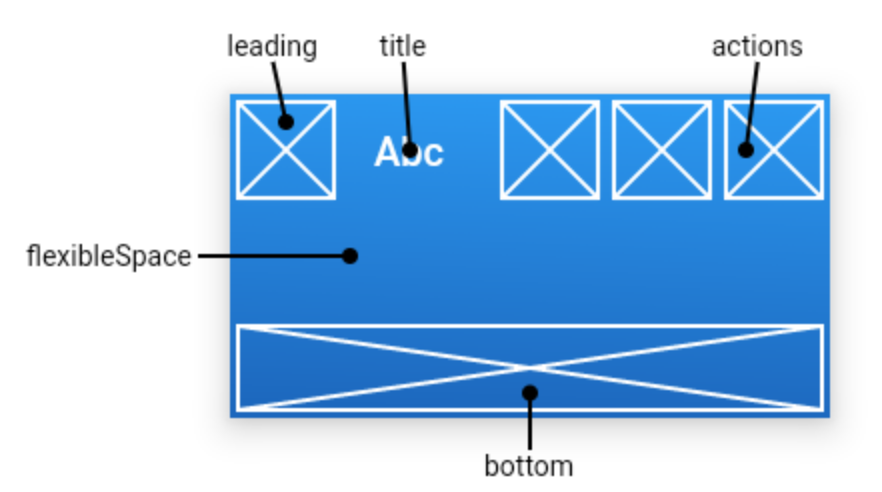

# flutter_movie_douban
豆瓣API地址：https://douban-api-docs.zce.me/

Api V2包括：

* 图书 Api V2
* 电影 Api V2
* 音乐 Api V2
* 同城 Api V2
* 广播 Api V2
* 用户 Api V2
* 日记 Api V2
* 相册 Api V2
* 线上活动 Api V2
* 论坛 Api V2
* 回复 Api V2
* 我去 Api V2

API有很多，足够学习使用，本项目只是使用电影api学习一下google flutter技术。
当第一次接触flutter就被他简单的编程方式，一次编码可以在Android和IOS两大平台运行，以及流畅的API，高性能的渲染深深吸引。

## 开发成果（开发完成后编写）

## 开发计划
第一期计划
完成电影api中榜单的三个
榜单API有正在热映、即将上映、Top250、口碑榜、北美票房榜、新片榜。首先完成前三个
编码计划
1. 创建项目
2. 代码托管的Github上
3. AppBar的设计与实现
4. 侧边栏的设计与实现
5. 底部导航的设计与实现
6. 电影列表的设计与实现
7. 电影详情的设计与实现
8. 打包android和ios安装包
第一项开发结束

第二期计划...待定

## 开发开发
###### 1. 创建项目
开发flutter项目可以使用终端命令、Android Studio、VSCODE等创建项目，这里非常easy，不做阐述，网上很多文章。
###### 2. 使用Github托管项目
我喜欢使用命令的方式托管项目，因为使用命令不限于开发工具，使用任何开发工具都可以轻松托管代码，省去了学习的时间。
###### 3. AppBar的设计与实现

[AppBar官方文档](https://api.flutter.dev/flutter/material/AppBar-class.html)
参考官方文档，这里我决定使用三部分leading、title、actions
leading就是一个开启侧滑菜单的开关
title是标题
actions放一个搜索
代码实现
~~~

~~~